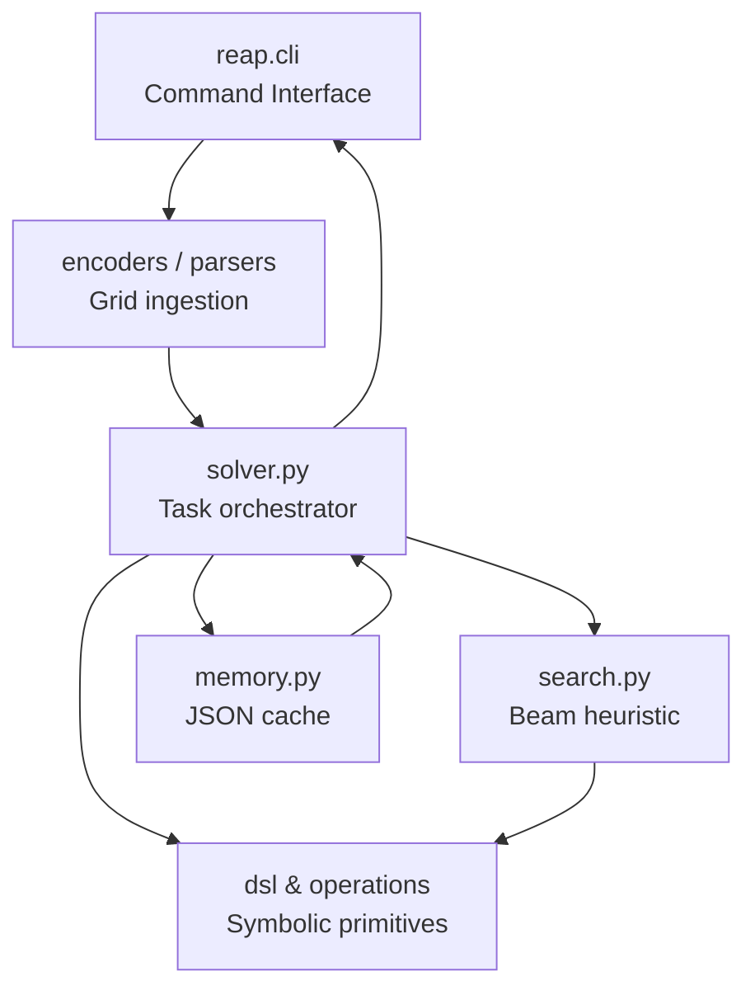

# ArcPrize2025 – REAP

[](https://www.apache.org/licenses/LICENSE-2.0)
[](https://www.python.org/downloads/release/python-3100/)


## Abstract / TL;DR
**REAP (Recursive Emergent Abstraction Program)** is a prototype solver for the [Abstraction and Reasoning Challenge (ARC)](https://arcchallenge.org/). It composes transformations expressed in a symbolic domain-specific language (DSL), parses object-centric features from grids, and searches over candidate programs using heuristic beam search backed by a lightweight memory database. REAP currently targets research workflows rather than leaderboard submissions: it is optimized for introspection, rapid iteration on DSL design, and reproducibility. It does **not** yet provide a full training pipeline, neural components, or automated DSL learning.

## Demo


Example 3×3 task solved with REAP:

| Phase | Grid |
| --- | --- |
| Train Input | <table><tr><td style="background:#000000;color:#fff">0</td><td style="background:#ff0000;color:#fff">2</td><td style="background:#0000ff;color:#fff">1</td></tr><tr><td style="background:#0000ff;color:#fff">1</td><td style="background:#000000;color:#fff">0</td><td style="background:#ff0000;color:#fff">2</td></tr><tr><td style="background:#ff0000;color:#fff">2</td><td style="background:#0000ff;color:#fff">1</td><td style="background:#000000;color:#fff">0</td></tr></table> |
| Train Output | <table><tr><td style="background:#0000ff;color:#fff">1</td><td style="background:#000000;color:#fff">0</td><td style="background:#ff0000;color:#fff">2</td></tr><tr><td style="background:#ff0000;color:#fff">2</td><td style="background:#0000ff;color:#fff">1</td><td style="background:#000000;color:#fff">0</td></tr><tr><td style="background:#000000;color:#fff">0</td><td style="background:#ff0000;color:#fff">2</td><td style="background:#0000ff;color:#fff">1</td></tr></table> |
| Test Input | <table><tr><td style="background:#000000;color:#fff">0</td><td style="background:#ff0000;color:#fff">2</td><td style="background:#0000ff;color:#fff">1</td></tr><tr><td style="background:#0000ff;color:#fff">1</td><td style="background:#000000;color:#fff">0</td><td style="background:#ff0000;color:#fff">2</td></tr><tr><td style="background:#ff0000;color:#fff">2</td><td style="background:#0000ff;color:#fff">1</td><td style="background:#000000;color:#fff">0</td></tr></table> |
| Predicted Output | <table><tr><td style="background:#0000ff;color:#fff">1</td><td style="background:#000000;color:#fff">0</td><td style="background:#ff0000;color:#fff">2</td></tr><tr><td style="background:#ff0000;color:#fff">2</td><td style="background:#0000ff;color:#fff">1</td><td style="background:#000000;color:#fff">0</td></tr><tr><td style="background:#000000;color:#fff">0</td><td style="background:#ff0000;color:#fff">2</td><td style="background:#0000ff;color:#fff">1</td></tr></table> |

*(Colors follow the canonical ARC palette; replace the placeholder GIF with one generated from `reap.cli` once available.)*

## Architecture Overview



**Data flow during a run**
1. **CLI** loads ARC JSON tasks and streams them into structured `Example` objects.
2. **Parser/encoders** normalize grids, infer color maps, and extract object candidates.
3. **Solver** classifies each task, selecting an operator subset and search hyperparameters.
4. **Search** enumerates DSL programs via beam search, pruning using object/shape heuristics.
5. **DSL primitives** execute candidate programs on the train/test grids.
6. **Memory DB** checks for previously solved tasks and caches new successes.
7. **CLI** serializes predictions and statistics, emitting CSV traces for later analysis.

## Installation

> Python ≥ 3.10 is required. All core modules depend only on the Python standard library.

### Using `uv`
```bash
uv venv --python 3.11 .venv
source .venv/bin/activate
uv pip install pytest rich  # optional tooling for development
```

### Using `pip`
```bash
python3.11 -m venv .venv
source .venv/bin/activate
pip install --upgrade pip
pip install pytest rich
```

For local development, add the repository root to `PYTHONPATH` (or run commands from the root) so that `import reap` succeeds. Optional extras—`pytest`, `rich`, `tqdm`—support testing and richer logging but are not required for basic solves.

## Quickstart

### Solve a single task file
```bash
python -m reap.cli --infile data/samples/arc_task.json --outfile runs/sample_submission.json \
  --time_per_task 20 --max-workers 1
```

### Solve an entire directory
```bash
python - <<'PY'
from pathlib import Path
import json
from reap.cli import main

inputs = sorted(Path('data/arc_public').glob('*.json'))
for task_file in inputs:
    output_file = Path('runs') / f"{task_file.stem}_predictions.json"
    output_file.parent.mkdir(exist_ok=True)
    main([
        '--infile', str(task_file),
        '--outfile', str(output_file),
        '--time_per_task', '15',
        '--max-workers', '4',
    ])
PY
```

### Configuration example
Although the CLI currently exposes only a handful of flags, you can drive REAP programmatically with a YAML/JSON configuration for search hyperparameters:

```yaml
# configs/beam_search.yaml
search:
  time_budget_s: 12.0
  beam_size: 96
  max_depth: 6
  allow_ops:
    - rotate
    - flip
    - map_color
    - pad
    - crop
    - transform_by_object_template
pruning:
  keep_dims_mismatch: false
  hamming_threshold: 5
```

```bash
python - <<'PY'
import json
import yaml
from types import SimpleNamespace
from pathlib import Path
from reap.search import SearchConfig
from reap.solver import solve_task

spec = json.loads(Path('data/samples/arc_task.json').read_text())
config = yaml.safe_load(Path('configs/beam_search.yaml').read_text())
search_cfg = SearchConfig(**config['search'])

for tid, task in spec.items():
    task_ns = SimpleNamespace(
        train=[SimpleNamespace(**pair) for pair in task['train']],
        test=[SimpleNamespace(**pair) for pair in task['test']],
    )
    attempts, stats = solve_task(task_ns, time_budget_s=search_cfg.time_budget_s)
    print(tid, stats)
PY
```

## CLI Reference

| Flag | Default | Description |
| --- | --- | --- |
| `--infile` | (required) | ARC JSON file containing `train`/`test` grids. |
| `--outfile` | `submission.json` | Where to write predictions (and `.stats.csv`). |
| `--time_per_task` | `20.0` | Wall-clock seconds allotted to each task. |
| `--max-workers` | `1` | Number of `ProcessPoolExecutor` workers (`≤0` → CPU count). |

Common invocations:

```bash
# CPU-saturated solve with extended budget
python -m reap.cli --infile data/arc_public/evaluation.json --time_per_task 30 --max-workers 0

# Deterministic single-thread sweep for debugging
python -m reap.cli --infile data/sanity/pairs.json --time_per_task 5 --max-workers 1
```

## Logging & Reproducibility
- **Structured CSV**: Every run emits `<outfile>.stats.csv` with depth, beam size, candidates, and elapsed time. Use it for regression tracking.
- **Missing-op journal**: Failures trigger appends to `missing_ops.jsonl` (one JSON object per task) for DSL triage.
- **Seeds & determinism**: The solver is deterministic given a fixed Python version and identical JSON input. Randomness enters only through multiprocessing scheduling.
- **Version stamp**: Include the current `git describe --always` output in experiment notes to tie results to DSL/search revisions.

Sample tail of a stats file:
```csv
task_id,elapsed,from_mem,depth_reached,valids_found,best_firstpair_distance,survivors_per_depth,kept_after_filter,total_candidates,crashes_during_apply,best_dims_match
055d64,12.44,False,5,3,0,"[64, 128, 96, 48, 12]",874,2816,0,True
2b01ca,0.82,True,,,,,,,,
```

## Memory DB
- **Schema**: `memory_db.json` maps MD5 hashes of the training pairs to lists of output grids. Example:
  ```json
  {
    "9f2d...": [
      [[0, 0], [0, 0]],
      [[1, 1], [1, 1]]
    ]
  }
  ```
- **Versioning**: A `schema_version` key will be added before the 2025 qualifier release. Until then, delete the file if schema changes break compatibility.
- **Pruning**: Periodically remove entries with obsolete DSL operators or large grids to avoid stale solutions.
- **Migration**: Use a simple migration script to wrap existing records with metadata if a future format requires it.

## Datasets
1. **Fetch public ARC tasks**
   ```bash
   mkdir -p data/arc_public
   curl -L https://raw.githubusercontent.com/fchollet/ARC/master/data/training/484b58aa.json -o data/arc_public/484b58aa.json
   curl -L https://raw.githubusercontent.com/fchollet/ARC/master/data/evaluation/09629f59.json -o data/arc_public/09629f59.json
   ```
2. **Directory structure**
   ```text
   data/
     arc_public/
       training/*.json
       evaluation/*.json
     samples/
       arc_task.json
   runs/
     <timestamp>_submission.json
     <timestamp>_submission.stats.csv
   ```
3. **Custom tasks**: Follow the Kaggle ARC JSON schema—arrays of integers 0–9 representing colors.

## Evaluation
- **Unit tests** (in progress):
  ```bash
  pytest -q
  ```
- **Micro-benchmark** (single task throughput):
  ```bash
  python -m timeit -n 5 -r 3 "from reap.cli import main; main(['--infile','data/samples/arc_task.json','--outfile','/tmp/out.json','--time_per_task','5','--max-workers','1'])"
  ```
- **Metrics snapshot**: inspect `<outfile>.stats.csv` for search statistics; compute aggregate accuracy by comparing predictions to ground truth with `reap.grid_utils.eq_grid`.

Example metric log:
```text
[3/10] Task 484b58aa done in 7.42s | depth=6 valids=2 best_d=0 beam=[64, 128, 64]
   -> Correct on training! Added to memory.
```

## Roadmap
- **Low**: Harden DSL primitives with exhaustive unit tests and add CI for Python 3.10–3.12 (ensures stability when expanding operator set).
- **Moderate**: Introduce schema-versioned memory DB with eviction policies (prevents stale programs when DSL evolves) and expose config-driven search parameters via CLI.
- **Ambitious**: Hybridize REAP with neural policy priors or self-play DSL induction (targets competitive performance in the Arc Prize 2025 finals).

## Contributing
- Follow [PEP 8](https://peps.python.org/pep-0008/) and type annotate new functions.
- Add or update `pytest` coverage for every change touching the DSL, search, or memory modules.
- When filing issues, include: task JSON, CLI invocation, Python version, and whether memory DB was enabled (attach minimal reproduction if possible).
- Use conventional commits (e.g., `feat: add repeat_scale heuristic`) when submitting pull requests.

## License & Citations
- **License**: Apache-2.0 (final text pending repository update).
- **Citation**: If you use REAP in academic work, cite as:
  ```bibtex
  @software{reap2025,
    author    = {ArcPrize Team},
    title     = {REAP: Recursive Emergent Abstraction Program Solver},
    year      = {2024},
    url       = {https://github.com/arcprize/ArcPrize2025}
  }
  ```
- **Acknowledgments**: Built upon the ARC framework introduced by François Chollet and extended by the Arc Prize 2025 community.

## FAQ & Safety
- **Does REAP guarantee a solution?** No. It is a heuristic enumerator; hard tasks may time out or return fallbacks.
- **How long can a run take?** Default limit is 20s per task; increase cautiously to avoid runaway search states.
- **Compute requirements?** A 4-core laptop with 8 GB RAM comfortably runs small batches; large sweeps benefit from ≥16 cores and SSD-backed storage for the memory DB.
- **Can it run without the memory DB?** Yes—delete `memory_db.json` to disable caching and ensure fresh solves.
- **Safety considerations?** REAP executes only symbolic grid transformations—there are no external network calls or code generation. Monitor resource usage to avoid starved systems during exhaustive search.
